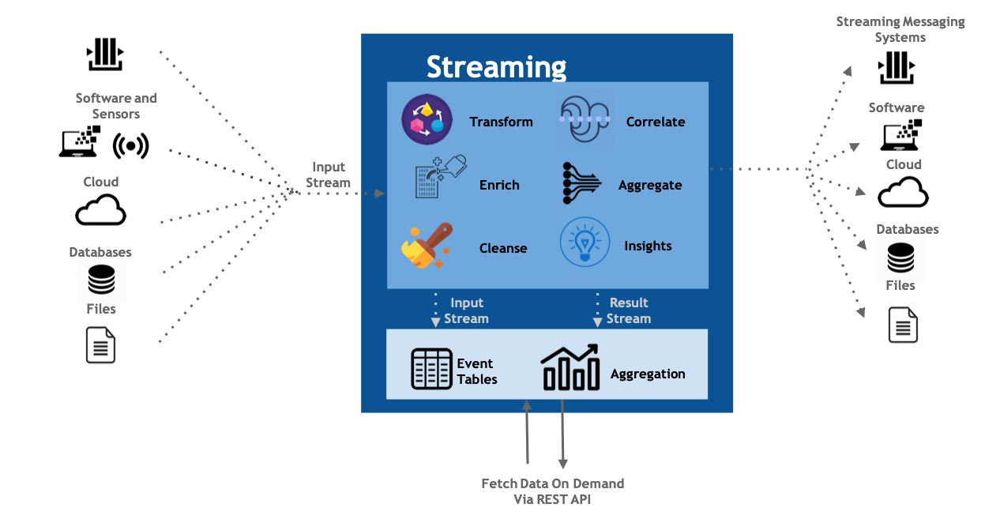

<!--
  ~  Copyright (c) 2017, WSO2 Inc. (http://wso2.com) All Rights Reserved.
  ~
  ~  WSO2 Inc. licenses this file to you under the Apache License,
  ~  Version 2.0 (the "License"); you may not use this file except
  ~  in compliance with the License.
  ~  You may obtain a copy of the License at
  ~
  ~    http://www.apache.org/licenses/LICENSE-2.0
  ~
  ~  Unless required by applicable law or agreed to in writing,
  ~  software distributed under the License is distributed on an
  ~  "AS IS" BASIS, WITHOUT WARRANTIES OR CONDITIONS OF ANY
  ~  KIND, either express or implied.  See the License for the
  ~  specific language governing permissions and limitations
  ~  under the License.
  -->
  
# Streaming Integrator

[](https://wso2.org/jenkins/view/wso2-dependencies/job/products/job/streaming-integrator/)
  [](https://github.com/wso2/streaming-integrator/releases/)
  [](https://github.com/wso2/streaming-integrator/releases)
  [](https://github.com/wso2/streaming-integrator/commits/master)
  [](https://github.com/wso2/streaming-integrator/commits/master)
  [](https://opensource.org/licenses/Apache-2.0)

## Overview

WSO2 Streaming Integrator (SI) is a streaming data processing server that allows you to integrate streaming data and take action based on streaming data.

WSO2 SI can be effectively used for:
- Realtime ETL with files, DBs, SaaS apps, HTTP endpoints, etc.
- Working with streaming messaging systems such as Kafka and NATS.
- Streaming data integration 
- Executing complex integrations based on streaming data with [WSO2 Micro Integrator](https://github.com/wso2/micro-integrator).

WSO2 SI is powered by [Siddhi.io](https://siddhi.io/), a well-known cloud native open source stream processing engine. Siddhi lets users write complex stream processing logic using a SQL-like language known as [SiddhiQL](https://siddhi.io/en/v5.0/docs/). You can aggregate, transform, enrich, analyze, cleanse and correlate streams of data on the fly using Siddhi queries and constructs.

WSO2 SI lets you connect to any data source with any destination regardless of different protocols and data formats that are used by different endpoints. The SI store API provides the capability to fetch stored and aggregated data kept in-memory and in DBs via a REST API on demand using ad-hoc queries.

[SI tooling](https://github.com/wso2/streaming-integrator-tooling) provides a web-based IDE that allows you to build Siddhi applications with a drag-and-drop graphical editor, or a streaming SQL code editor. Its capability to simulate data streams and to debug Siddhi queries facilitates you to test your Siddhi applications. Created Siddhi applications can be directly deployed in a VM via the IDE, exported as a Docker image, or deployed as K8s artifacts that can be used with the Siddhi K8s Operator.

SI has native support for Kubernetes with a [K8s Operator](https://siddhi.io/en/v5.1/docs/siddhi-as-a-kubernetes-microservice/) designed to provide a convenient way of deploying SI on K8s. SI has a very simple deployment architecture, and you can achieve high availability with zero data loss with two nodes of SI.

Integration flows deployed in [WSO2 Micro Integrator (MI)](https://github.com/wso2/micro-integrator) can be invoked directly by SI in a seamless manner using low latency RPC. This allows you to build robust data processing and integration pipelines by combining powerful streaming and integration capabilities.



## Download

WSO2 Streaming Integrator is currently in the development stage. Therefore, you can download the source of WSO2 Streaming Integrator and build it. For detailed instructions, see the [Building from the Source section](#building-from-the-source).
<!-- Please download the latest WSO2 Streaming Integrator release from [here]()  -->

## Building from the Source

Please follow the steps mentioned below to build WSO2 Streaming Integrator from source.

1. Clone or download the source code from this repository
2. Run `mvn clean install` from the root directory of the repository
3. The generated Streaming Integrator distribution can be found at `streaming-integrator/modules/distribution/target/-streaming-integrator-<version>.zip`

## Getting Started

Please refer the below guides to get started with the Streaming Integrator.

* [Quick Start Guide](https://ei.docs.wso2.com/en/next/streaming-integrator/quick-start-guide/getting-started-with-si/): Step by step guide to get your first Siddhi application running in less than 5 minutes.

* [Streaming Integrator 101](): A 30 minute guide to explore the end to end development lifecycle of the Streaming Integrator.

## Deploy in Docker

WSO2 Streaming Integrator has a Docker distribution so that it can be deployed in any container-orchestration system.
The Docker image can be built from the source, or downloaded directly from Docker Hub.

### Build the Docker Image

!!!tip"Before you begin:"
    You need to install Docker in the host machine.

To build the Docker image from the source, issue the following command from the root directory. <br/>
`mvn clean install -Ddocker.skip=false`

### Get the Image from Docker Hub

To get the Docker image from Docker Hub, issue the following command.


```bash
docker pull wso2/streaming-integrator
```

## Deploy in Kubernetes

WSO2 Streaming Integrator can be deployed in a Kubernetes cluster using Siddhi Operator.

* [Siddhi operator](https://github.com/siddhi-io/siddhi-operator) enables the deployment of Siddhi applications directly in your Kubernetes cluster using a Kubernetes Custom Resource.
For more details please refer to [Installing Streaming Integrator Using Kubernetes](https://docs.wso2.com/display/INSTALL/Installing+Enterprise+Integrator+Using+Kubernetes).

## Support

We are committed to ensuring that your enterprise middleware deployment is completely supported from evaluation to production. Our unique approach ensures that all support leverages our open development methodology and is provided by the very same engineers who build the technology.

For more details and to take advantage of this unique opportunity please visit our [support site](http://wso2.com/support).


## Reporting Issues

We encourage you to report issues, documentation faults and feature requests regarding WSO2 Streaming integrator through the [WSO2 SI Issue Tracker](https://github.com/wso2/streaming-integrator/issues).
